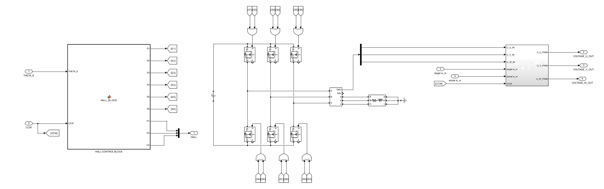

## Requieres: MATLAB R2023b, Simscape, Simscape Multibody, Simscape Electrical Simulink, Robotic System Toolbox, Symbolic Math Toolbox.

---

# Modeling of a three link manipulator

## Inverse Dynamics
Using **inverse dynamics** to determined the torques which are required to manipulate the multi-body system so that the desired joint angles are achieved. Within the scope of this project, these torques are applied as a **load torque** ($\tau_l$) to the actuators. For this calculation, the **Lagrange formulation** is utilized. The advantage of this formulation lies in the fact that the equations of motion can be calculated using a systematic computational procedure (Siciliano et al., 2009, p. 248).

The Lagrangian ($\mathcal{L}$) is derived from the difference between the **kinetic energy** ($T$) and the **potential energy** ($U$):

$$\mathcal{L} = T - U$$

The equations of motion are then derived using the Euler-Lagrange equation If non-conservative forces $\epsilon_i$ (such as frictional forces) are present between the joints, the equation is defined as follows:

$$\frac{d}{dt} \left( \frac{\partial \mathcal{L}}{\partial \dot{q}_i} \right) - \frac{\partial \mathcal{L}}{\partial q_i} = \epsilon_i$$

Where:
* $q_i$: Joint positions
* $\dot{q}_i$: Joint velocities
* $\epsilon_i$: Generalized forces/torques

## Kinetic Energy $T$
The kinetic energy of a rigid body is the sum of the translational energy $T_{trans}$ and the rotational energy $T_{rot}$. The translational energy of a mass point is proportional to its mass $m$ and the square of its linear velocity $\vec{v}$ (Wikipedia, 2023):

$$T_{trans} = \frac{1}{2} m \vec{v}^T \vec{v}$$

$$T_{v} = \frac{1}{2} m (\dot{x}^2 + \dot{y}^2 + \dot{z}^2)$$

This means that the Cartesian coordinates for each individual mass position must first be defined, differentiated, and squared to determine the linear velocity.

The rotational energy is derived from the inertia tensor $I$ and the angular velocity $\vec{\omega}$ squared (Wikipedia, 2022):

$$T_{rot} = \frac{1}{2} \vec{\omega}^T I_{inertia} \vec{\omega}$$

The **inertia tensor** is a $3 \times 3$ symmetric matrix containing the mass moments of inertia on its diagonal and the products of inertia on its off-diagonal elements (Kasadin & Paley, 2011, p. 481). For the manipulator discussed here, complex shapes are avoided, and a **solid cylinder** is assumed for all three bodies. The corresponding inertia tensor matrix can be obtained from standard tables.

It is crucial to note that the elements of the inertia matrix are defined in the **local frame** of the respective body. Therefore, to ensure that the inertia matrix remains independent of the manipulator configuration, the angular velocity must be referenced to the body's local frame.

If the joints have been defined using the **Denavit-Hartenberg (D-H) convention**, the angular velocity can be transformed using the transposed rotation matrix $R_i$ from Link $i$ to Link $i-1$ (Siciliano et al., 2009, p. 251):

$$\omega_{i-1} = R_i^T \omega_i$$

The total kinetic energy is then calculated as the sum of translational and rotational components:

$$T = T_{trans} + T_{rot}$$

## Potential Energy $U$
The final component required for the Lagrange formulation is the potential energy. If spring energy is neglected, the potential energy corresponds to the gravitational potential energy (Wikipedia, 2023):

$$U = mgh$$

The heights $h$ are derived from the position vectors of the masses, specifically from the $z$-components (in the world coordinate system).

## Generalized Forces
The generalized force $\epsilon$ is derived from the contributions of the actuation torque $\tau$ at the joint and the viscous friction torques (Siciliano et al., 2009, p. 249):

$$\epsilon = \tau - b \dot{\theta}$$

By performing a free-body analysis (cutting) of the links, torque matrices can be established for all joints. In this project, for the sake of simplicity, it is assumed that for one-dimensional joints, forces act exclusively on the joint axis.

---

---

# Modeling of a Three-Phase BLDC Motor

## 1. Requirements for Robotic Actuators
To realize joint movements, actuators are required to provide the necessary torque (or forces). These can be pneumatic, hydraulic, or electrical in nature, each offering its own specific advantages. Generally, however, these actuators should possess several critical performance characteristics. For instance, a **low moment of inertia** combined with a **high power-to-weight ratio** is essential. This enables the actuators to execute fast and precise movements without being significantly hindered by their own mass (Siciliano et al. 2009, p. 193f).

According to Siciliano et al. (2009, p. 194f), **electric servomotors** are the most frequently used actuators in robotic applications. Among these, the two most common types are:
* Permanent Magnet DC motors (PMDC)
* Brushless DC motors (BLDC)

## 2. BLDC Motor Characteristics
In this repository a **three-phase BLDC motor** was modeled. In contrast to conventional DC motors, the stator consists of multi-phase windings, while the rotor is equipped with permanent magnets. By eliminating brushes and commutators, electrical and mechanical losses are reduced, resulting in higher efficiency and longevity. Furthermore, moving the windings to the stator improves heat dissipation. Overall, this leads to a more compact design and allows for lower-inertia rotors compared to conventional permanent magnet DC motors (Siciliano et al. 2009, p. 195).

## 3. Simulation Environment and Components
For this purpose, a **DC voltage source** was connected with **six MOSFETs** from the Simscape library. Since the direct voltage signals from the voltage source are only compatible with Simscape components, a **Simscape Three-Phase Measurement Block** was inserted, and the voltages were tapped at the measurement output.

### Functional Principle
The functionality of a BLDC motor is based on the interaction of two magnetic fields: 
1. An electromagnetic field from a coil on the stator.
2. A magnetic field from a permanent magnet on the rotor.
The magnetic attraction between the north and south poles generates torque and rotates the rotor. The rotation of the rotor is maintained by changing the direction of the current in the stator windings, a process known as **commutation**.

## 4. Control Logic and Sensor Integration
To switch the stator windings at the correct time, it is essential to determine the position of the rotor. This requires at least **three Hall-effect sensors**, which are each offset by 120° (Yamashita et al. 2017, p. 3).
The Hall-effect sensors are simulated within a **Simulink Function block** using an `if` group. For this, the electrical rotor position $\theta_e$ is utilized. Depending on the Hall status and the direction of rotation, the MOSFET control signals are implemented in a subsequent `if` group.

---

---

# Implementation in Simulink

Based on the mathematical foundations, four **Simulink Function blocks** were developed to calculate the following aspects: current, electromotive force (EMF), electromagnetic torque, and rotor speed.
The equations listed previously are implemented directly within these Function blocks, with the corresponding variables interconnected. Rather than providing a detailed breakdown of every block, the following key implementation aspects are highlighted:

## 1. Electromotive Force (EMF) Simulation
The electromotive force is simulated using a **trapezoidal function**. To achieve this, the electrical rotor angle (defined as the mechanical rotor angle $\theta_m$ multiplied by the number of pole pairs $p$) is processed within an `if` statement. The EMF reaches its peak whenever the magnetic poles of the rotor pass directly by the stator coils.

## 2. Simulation Start-up Logic
Since the rotor speed $w_m$ is a fundamental variable in the motor equations, it must be ensured that the rotor successfully accelerates from a standstill at the start of the simulation. This is managed using two **Delay blocks** at the "Rotor Speed Block":
* A $Z^{-1}$ delay, which applies a non-zero motor torque for the first simulation step.
* A $Z^{-4}$ delay, which ensures the load torque $\tau_l$ is only engaged after four simulation steps.

## 3. Unit Consistency
Precise adherence to units is critical, particularly regarding the rotor variables:
* **Angular Velocity:** $w_m$ is initially output from the Motor Speed Block in $rad/s$, whereas the voltage constant may be provided in $V/kRPM$.
* **Rotor Position:** The position is required within a range of $0$ to $2\pi$ for the control logic, but the raw integration value reflects the total cumulative rotation in radians.

---
